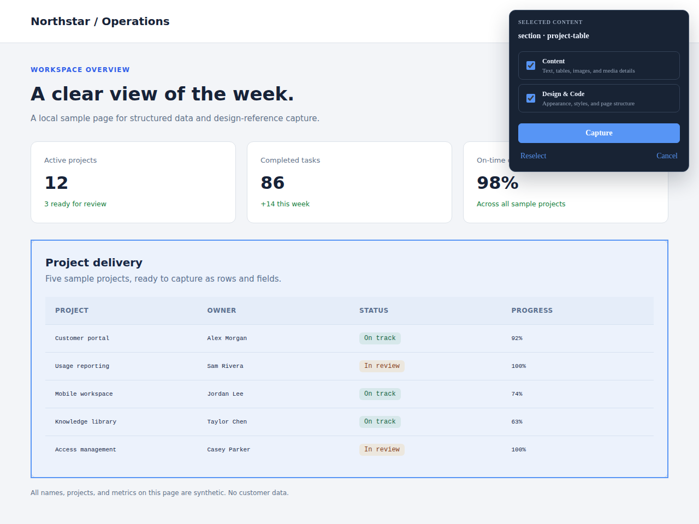
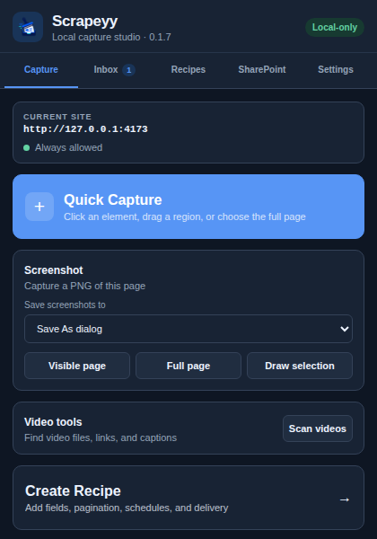
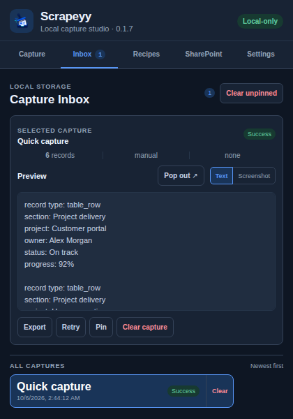
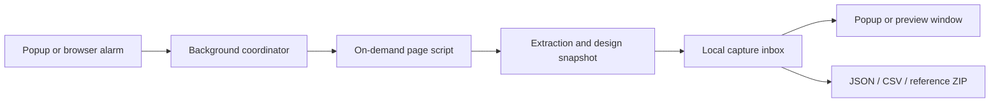

# Scrapeyy

**Turn a page selection into structured data and a design reference.**

Scrapeyy is a local-first browser extension built with TypeScript, React, and WXT.
Select a table, card collection, or page region; preview the captured data in a
local inbox; then export JSON, CSV, or a reference ZIP. Chrome MV3 and Firefox MV2
builds share the same capture engine.



<table>
  <tr>
    <td align="center"></td>
    <td align="center"></td>
  </tr>
  <tr><td align="center">Choose a capture tool</td><td align="center">Preview, pin, or export the result</td></tr>
</table>

Actual extension UI with synthetic local data. A [separate preview window](docs/screenshots/capture-preview.png)
keeps long captures readable after the toolbar popup closes.
[Screenshot provenance and demo page](docs/screenshots/README.md).

## What you can do

- **Capture precisely:** click an element, drag a region, or select the full page.
  Content and Design & Code can be enabled independently.
- **Extract useful structure:** native and ARIA tables, repeated cards/lists,
  dashboard metrics, visible text, links, images, and media details.
- **Keep results locally:** Inbox previews, pinning, retention, retryable runs,
  and a resizable text/screenshot preview window.
- **Automate repeat work:** reusable recipes, bounded pagination/infinite scroll,
  and browser schedules with optional access to specific origins.
- **Export references:** JSON and CSV plus sanitized HTML, computed CSS, image
  assets, and a screenshot when browser capture is available. Standalone tools
  also capture visible, scrolling full-page, or selected-region PNGs.

## Try it in five minutes

Requires **Node.js 24** and npm. From this checkout:

```bash
git clone https://github.com/AaronCampbellit/Scrapeyy-public.git
cd Scrapeyy-public
npm ci
npm run build
npm exec -- vite docs/screenshots --host 127.0.0.1 --port 4173
```

1. Open `chrome://extensions`, enable **Developer mode**, choose **Load unpacked**,
   and select `.output/chrome-mv3`.
2. Open [the synthetic demo](http://127.0.0.1:4173/demo.html), then click Scrapeyy's
   toolbar icon and choose **Quick Capture**.
3. Select the **Project delivery** panel. Leave **Content** and **Design & Code**
   enabled, then press **Capture**.
4. Reopen Scrapeyy → **Inbox**. Expect five table rows and one readable text record.
   Try **Pop out ↗** or **Export** to inspect the result.

For Firefox, run `npm run build:firefox`, open
`about:debugging#/runtime/this-firefox`, choose **Load Temporary Add-on**, and
select `.output/firefox-mv2/manifest.json`. Temporary installs last for that
browser session. Reload the extension after replacing build files.

One-time captures use the toolbar's active-tab grant. Reusable and scheduled
recipes request persistent access to their website origin. More fixtures are
available with `npm run fixtures`; the [usage guide](docs/USAGE.md) covers recipes,
permissions, screenshots, video discovery, scheduling, and export destinations.

## How it works



| Component | Responsibility |
|---|---|
| [Entrypoints](entrypoints/) | React popup/preview, page UI in a shadow root, background message handling |
| [Extraction](src/extraction/) and [traversal](src/traversal/) | Dataset detection, normalization, record deduplication, bounded page advancement |
| [Storage](src/storage/) | IndexedDB captures/assets; extension-local recipes, projects, and settings |
| [Design](src/design/) and [export](src/export/) | DOMPurify sanitization, computed styles, asset manifests, stable JSON/CSV/ZIP serialization |
| [Platform](src/platform/) and [scheduling](src/scheduling/) | Browser permissions, injection, downloads, screenshots, temporary tabs, alarms |

Implementation details include navigation recovery for in-progress recipes,
scroll-and-stitch capture with page-state restoration, fixed ZIP timestamps for
repeatable exports, and a preview window with its own IndexedDB connection and
managed image URLs. The on-demand picker stylesheet is explicitly packaged as a
web-accessible resource; website access remains optional.

## Verification

```bash
npm test
npm run typecheck
npm run build
npm run build:firefox
```

Verified on **2026-10-06**: 31 Vitest files / 159 tests, strict type checking,
and both production builds passed. After the stylesheet packaging change, both
builds, type checking, and all four content-injection tests passed again.
An unpacked Chrome MV3 build in Chromium completed selection → Inbox → pop-out
preview → ZIP export on the synthetic page. The ZIP contained six records, JSON/CSV,
HTML/CSS, an asset manifest, and a run manifest.

Installed Firefox/Zen verification for the current build is still pending.
The [acceptance checklist](docs/ACCEPTANCE.md) records earlier release evidence
and distinguishes simulated browser APIs from installed-browser checks.

## Scope and limitations

This is a development extension, currently **0.1.7**. Captures and configuration
are stored in the browser; explicit exports and configured automatic downloads
write files to the device. Asset and SharePoint requests can use your existing
website session. Captured text and images may contain sensitive information, so
review an export before sharing it.

Scrapeyy does not bypass login, CAPTCHAs, or anti-bot controls. Design references
describe browser-visible markup and styles. Cross-origin frames, closed shadow
roots, canvas-only content, protected assets, virtualized feeds, and extremely
large pages can limit capture. A schedule needs the browser running, the required
origin permission, and a valid website session. Video downloads require an
exposed direct file; streaming playlists and blob-backed players remain metadata.

## License

Aaron Campbell reserves all rights to the original material he owns; see [LICENSE](LICENSE). Third-party code, dependencies, and assets retain their own licenses and notices. See [third-party notices](THIRD_PARTY_NOTICES.md) for reviewed components and outstanding publication or distribution requirements.
